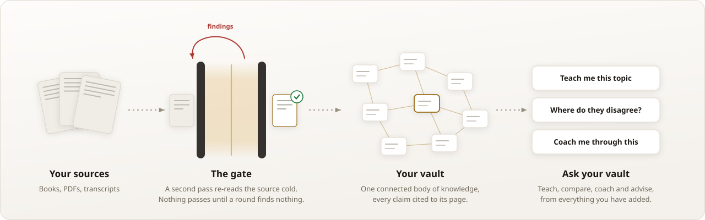
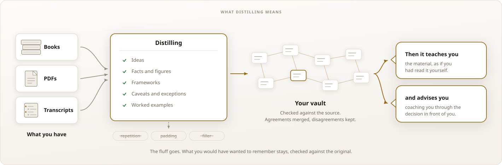
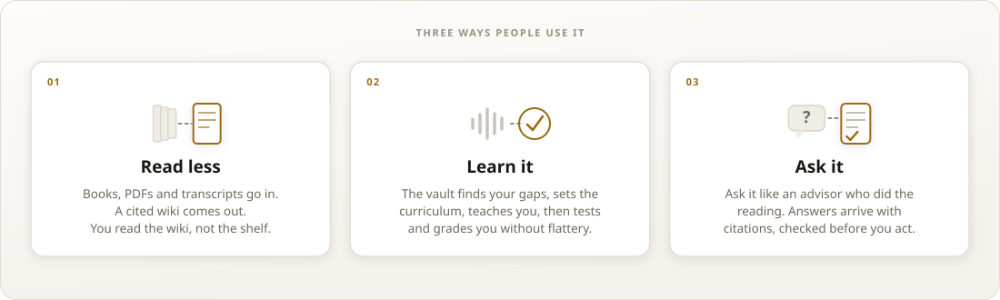
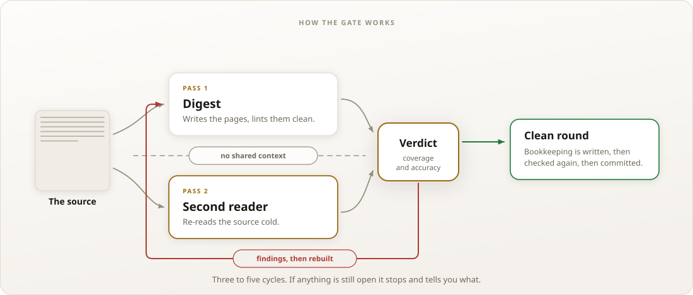
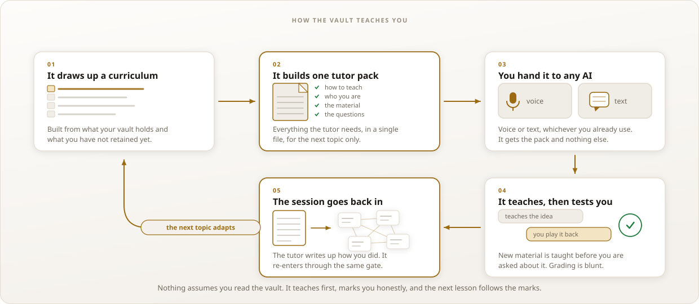

<a id="readme-top"></a>

<div align="center">

<picture>
  <source media="(prefers-color-scheme: dark)" srcset="docs/assets/logo-dark.svg">
  
</picture>

<h1>second-reader</h1>

<p><b>Not a second brain. A second reader.</b></p>

<p>Build a vault that can teach and advise you from your sources as if you'd carefully read and distilled them yourself.</p>

[![CI][ci-shield]][ci-url]
[![Agent Skills open standard][skills-shield]][skills-url]
[![16 lint checks][lint-shield]][lint-url]
[![Python 3.9+][py-shield]][py-url]
[![MIT license][mit-shield]][mit-url]

<p>
  <a href="#what-it-does">What it does</a> &middot;
  <a href="#what-you-can-do-with-it">What you can do with it</a> &middot;
  <a href="#install">Install</a> &middot;
  <a href="#your-first-hour">Your first hour</a> &middot;
  <a href="#how-the-gate-works">How it works</a> &middot;
  <a href="#what-it-costs">What it costs</a> &middot;
  <a href="#questions">Questions</a>
</p>

<picture>
  <source media="(prefers-color-scheme: dark)" srcset="docs/assets/hero-dark.svg">
  
</picture>

</div>

## What it does

You have more worth reading than you have time to read properly. Books bought for two chapters. Reports skimmed once. Transcripts you meant to come back to.

second-reader hands that material to your AI agent and gets back something durable: a Markdown vault holding the knowledge from those sources, checked against the originals, that your agent can teach you from, compare across, and advise you with later.

Obsidian opens the folder and you have a working vault. One idea per page, cross-linked throughout, every claim cited to the page it came from.

### Five books

Say five good books cover a subject you want to understand. The real value costs you all five readings, notes worth keeping, the caveats held on to, the disagreements between the authors worked out, and enough of it still in your head months later.

Give the five to second-reader instead. It pulls out the knowledge that matters, drops the repetition and filler, checks its work against the originals, and connects it into one vault.

Then ask your agent to teach you the subject, compare what the authors believe, or coach you through a decision using all five at once.

### What stays, and what goes

<picture>
  <source media="(prefers-color-scheme: dark)" srcset="docs/assets/distill-dark.svg">
  
</picture>

The vault keeps the ideas, the facts, the frameworks, the caveats, and the examples that carry a claim. Repetition, restatement and padding go. The bar is whether you could still use the material months later without opening the book.

> [!NOTE]
> The vault is plain Markdown on your own machine, and the skill itself sends nothing anywhere. Your sources are read by whatever AI model runs your agent, local or cloud, so the privacy boundary is your choice of harness.

## What you can do with it

<picture>
  <source media="(prefers-color-scheme: dark)" srcset="docs/assets/uses-dark.svg">
  
</picture>

- **Read less.** Sources go in, a distilled and cited wiki comes out. You read the wiki and go to the original only where a decision turns on it.
- **Learn it.** The vault works out what you have not retained, sets the curriculum, teaches you by voice or text, then tests you and grades you without flattery.
- **Ask it.** Query it like an advisor who did the reading. Anything you will act on passes the same verification gate before you see it.

Once the material is in, the asks look like this:

- "Teach me the core ideas across the five investing books I have added."
- "Where do these authors disagree about position sizing?"
- "I am negotiating a new role. Coach me using the negotiation material in my vault."
- "What do my sources say I should weigh before this decision?"
- "Quiz me on the leadership material."

### When it is worth using

Use it on material you wish you had read carefully: books, research papers, long reports, expert transcripts, course material, professional and regulatory references.

A quick summary of one document needs none of this. The cost is earned on material you expect to learn from, reason with, or decide from later.

second-reader preserves the quality of what you give it. It does not turn a weak source into an authoritative one.

## Install

second-reader is a folder with a `SKILL.md` at its root, which is the [Agent Skills](https://agentskills.io) open standard. Any harness that reads that standard can run it.

The fastest path, in Claude Code:

```sh
git clone https://github.com/mplind/second-reader.git ~/.claude/skills/second-reader
```

Check that it loaded, and that the tooling runs:

```sh
cd ~/.claude/skills/second-reader
python3 ops/lint.py fixtures/clean-vault
```

```text
lint: fixtures/clean-vault
 1. wikilink-resolution    clean
 2. split-wikilinks        clean
 ...
16. vault-walk             clean
result: CLEAN (16 checks, 0 findings)
```

That is the shipped lint tool passing its own reference vault. Then start a session and ask for what you want:

```text
Set up a knowledge vault about product management
```

<details>
<summary><b>Claude Code</b></summary>

Personal, available in every project:

```sh
git clone https://github.com/mplind/second-reader.git ~/.claude/skills/second-reader
```

One project only:

```sh
git clone https://github.com/mplind/second-reader.git .claude/skills/second-reader
```

Run `/skills` to confirm it is listed. Claude Code picks up new skill files during a session, but if `~/.claude/skills/` did not exist when the session started, restart once so the directory is watched.

</details>

<details>
<summary><b>Claude Desktop and claude.ai</b></summary>

Skills are managed from your account rather than the filesystem. Upload the folder and enable it from **Customize** in the Claude Desktop sidebar, or from the skills settings on claude.ai. See [Anthropic's Agent Skills documentation](https://platform.claude.com/docs/en/agents-and-tools/agent-skills/overview).

Sessions that run in the cloud do not read `~/.claude/skills/` on your machine, so a skill you only cloned locally will not be found there.

</details>

<details>
<summary><b>OpenClaw</b></summary>

OpenClaw installs skills from git directly, and expects `SKILL.md` at the repository root, which this repo has:

```sh
openclaw skills install git:mplind/second-reader --global
```

`--global` puts it in `~/.openclaw/skills` for every local agent. Without the flag it installs into the active workspace's `skills/` directory. Reinstall to update a git-sourced skill.

</details>

<details>
<summary><b>Hermes Agent</b></summary>

```sh
git clone https://github.com/mplind/second-reader.git ~/.hermes/skills/second-reader
```

`~/.hermes/skills/` is the primary skills directory. Hermes reads the agentskills.io format and loads skills by progressive disclosure, so the full protocol only enters context when you ask for vault work.

</details>

<details>
<summary><b>Cursor, VS Code and Copilot</b></summary>

Cursor reads `~/.cursor/skills/` and `~/.agents/skills/` for personal skills, plus `.cursor/skills/` and `.agents/skills/` in a project. It also still reads `~/.claude/skills/`, so a Claude Code install is picked up as-is.

```sh
git clone https://github.com/mplind/second-reader.git ~/.agents/skills/second-reader
```

For VS Code and GitHub Copilot, follow [their agent skills documentation](https://code.visualstudio.com/docs/copilot/customization/agent-skills).

</details>

<details>
<summary><b>Any other harness</b></summary>

Clone the repo into whatever directory your agent reads skills from. The [client list at agentskills.io](https://agentskills.io/clients) covers the harnesses that support the standard and links each one's install instructions.

If your harness cannot run isolated subagents, the skill still works and says so plainly: see [limits and portability](#limits-and-portability) for what the validation pass degrades to.

</details>

### What you need

| | |
|---|---|
| **An agent harness** | Anything that reads the Agent Skills format. Isolated subagents give the strongest verification. |
| **Python 3.9+** | For the lint tool and the exam scripts. Standard library only, nothing to install. |
| **Obsidian** | Optional. It is a viewer for the folder, not a dependency. Everything works on plain Markdown. |
| **Your sources** | PDFs, EPUBs, transcripts, articles, notes. Your agent converts them to text and checks the conversion before anything is written. |

## Your first hour

**1. Scaffold the vault.** Ask for it, and answer the three questions it asks: where the vault should live, what it is about, and enough about you to tune depth and framing.

```text
Set up a knowledge vault about product management
```

You get an empty, working skeleton:

```text
product-vault/
  AGENTS.md            the operating contract for this vault
  raw/
    inbox/             drop new material here
    retrieved/         sources the agent fetched for you
  wiki/                the distilled knowledge base
    index.md           catalog of every page
    sources.md         every raw file and its status
    log.md             append-only operation log
    contradictions.md  where sources disagree, and who holds which side
    open-loops.md      gaps and questions still to chase
    synthesis.md       the evolving thesis across everything
  ops/
    lint.py            the lint tool, copied in at scaffold
    ledger/            per-source conversion and coverage reports
    text/              converted working text, one per source
  daily/               daily notes and questions
```

**2. Add a source.** Put a file in `raw/inbox/`. The agent never edits, renames or deletes anything you put in `raw/`.

**3. Ingest it.** This is the expensive step, and it takes a while.

```text
Ingest Continuous Discovery Habits into my vault
```

The digest writes the pages and lints them clean. A second pass re-reads the source and audits what was written. Findings go back into another digest round. When a round finds nothing, bookkeeping is written, checked again, and committed.

**4. Check it yourself.** Scaffold copies the lint tool into the vault. It is deterministic and runs outside the model, so it is yours to run whenever you want:

```sh
cd ~/vaults/product-vault
python3 ops/lint.py .
```

It exits non-zero on any finding, which makes it usable in a pre-commit hook or a cron job.

**5. Ask it something.**

```text
What does my vault say about how many users to interview before a pattern is real? Cite sources.
```

You get an answer traced to the pages it came from, and back through those pages to the source and its location. That question is one your sources will disagree on, so you get both positions and who holds which, rather than whichever one the model reached for first. If the answer is worth keeping it files it back, so the vault gets richer with use.

## The operations

Eight operations, in plain language. You do not need the names.

| Ask for something like | What happens |
|---|---|
| "Set up a knowledge vault about X" | Scaffolds the folder skeleton and writes the vault's operating contract. |
| "Ingest this PDF into my vault" | The full loop: digest, lint, blind validation, repeat until a round is clean, then commit. |
| "What does my vault say about X? Cite sources" | Answers from the wiki with citations, and files the answer back if it is worth keeping. |
| "Audit my knowledge base, what is thin or unsourced?" | The whole-vault gate: cross-source defects that no single ingest can see. |
| "Lint the vault" | 16 deterministic checks on links, frontmatter, orphans, index truth and currency. |
| "Which gaps should I fill next?" | Names the specific sources or research that would close what is open. |
| "Build me a study curriculum from my vault" | The learning loop below. |
| "Resume where we left off" | Re-orients from the vault's own files, and reports anything that died mid-flight. |

More trigger phrases, including the ones that deliberately do **not** activate the skill, are in [docs/trigger-tests.md](docs/trigger-tests.md).

## How the gate works

The hard part is not writing the notes. It is checking that the knowledge survived, and that is where most of second-reader lives.

<picture>
  <source media="(prefers-color-scheme: dark)" srcset="docs/assets/gate-dark.svg">
  
</picture>

The validator receives the source, the finished pages and the rubric. It never sees the digest's reasoning or its self-assessment, and no bookkeeping exists yet when it runs, so there is nothing to anchor it. The loop stops on a clean round rather than on a round of fixes, because fix passes introduce their own defects.

Here is one catch, from [a real ingest](examples/coverage-report.md), re-domained with invented figures. The digest had produced a fluent, well-cited page and the citation resolved:

```text
VERDICT 2 (DEFECTS)
Mode 3 (over-firming): FINDING
  wiki/concepts/distance-record.md:12 states the ride as
  "1,913 kilometres in 7 days".
  Source (Book B, ch. 7) states the distance was covered in
  about five and a half days. The page imports the event
  window as a completion time the source never states.
  → NEEDS-ANOTHER-PASS
```

The page read well. The claim was wrong, and a reader who never saw the author's reasoning caught it.

<details>
<summary><b>Why an independent pass, and not self-review</b></summary>

Agent-maintained vaults fail in a particular way: generated pages accumulate, cite each other, and drift from their sources while staying perfectly formatted. A [2026 deployed-wiki audit](https://arxiv.org/abs/2607.24759) found pages recorded as complete, 20 of 20 claims covered, holding up at 14 and 12 under an evidence-only re-audit. Structural linting cannot see this, and human diff-approval does not scale to it.

A writer's own review is not an independent check either. LLM judges measurably [prefer their own output](https://aclanthology.org/2024.acl-long.826/), which is why the validator here is a separate pass that re-reads the source and never sees the author's reasoning.

The full evidence base, including where the evidence is thin, is in [references/evidence.md](references/evidence.md).

</details>

## How knowledge accumulates

Each new source is integrated with what is already in the vault. Related ideas get linked. Where sources agree, one concept page cites all of them. Where they disagree, the vault records both positions with who holds which, and carries that caveat onto every page that acts on the claim.

Thirty ingested sources become one connected body of knowledge rather than thirty summaries filed side by side. That is what makes "where do my sources disagree about this" a question the vault can answer at all.

## The learning loop

Optional, and the reason a learner tolerates the cost.

<picture>
  <source media="(prefers-color-scheme: dark)" srcset="docs/assets/loop-dark.svg">
  
</picture>

Ask for your curriculum and the vault designs one from its own gap analysis. Ask for the next topic and it generates a **tutor pack**: one self-contained file holding the tutor's instructions, a profile of you as the student, where you are in the syllabus, the teaching text, and the discussion questions. Hand that file to any conversational AI with a voice mode, or run it in text, and the session runs from it.

The tutor is vault-blind by design. It works only from the pack, so it cannot leak answers, and it teaches new material before asking you anything about it; nothing assumes you have read the sources. Only topics the curriculum already marks done are tested cold. Grading is blunt by instruction, because an inflated grade corrupts every scheduling decision after it. The tutor's written synthesis goes back into the inbox and re-enters through the same verification gate, with your own claims marked as hypothesis until they are checked.

Protocol: [references/curriculum.md](references/curriculum.md). Pack and runbook templates: [references/vault-templates.md](references/vault-templates.md).

## How it compares

Every project below does something adjacent. As of August 2026, from each project's public documentation:

| | Verification gate on every note and answer | Coverage measured, beyond citation checks | Learning loop that writes back |
|---|---|---|---|
| [Karpathy LLM-wiki pattern](https://gist.github.com/karpathy/442a6bf555914893e9891c11519de94f) | — | — | — |
| [claude-obsidian](https://github.com/AgriciDaniel/claude-obsidian) | partial: provenance ledgers and a two-source rule; review is single-pass and structural | — | — |
| [wiki-skills](https://github.com/kfchou/wiki-skills) | partial: strong per-page audit, invoked separately, not a gate | — | — |
| [LLM Wiki Newsroom](https://github.com/alfadur7/llm-wiki-newsroom) | partial: writer/reviewer separation with deterministic and qualitative gates; no source-cold re-read per claim | — | — |
| [BrainQuest](https://github.com/Martin8O/BrainQuest) | — | — | partial: FSRS tutor over a read-only vault; mastery stays outside it |
| **second-reader** | **mandatory, source-cold, loops to a clean round** | **closed-book exam scored against its claim ledger, 95% with named residuals** | **graded sessions re-enter through the same gate** |

Independent review exists elsewhere, and so do citation checking and vault tutors. second-reader requires all three and wires them together.

## What it costs

> [!IMPORTANT]
> This is expensive by design. A 300-page book takes roughly 20 to 30 agent passes across digest, validation and exam cycles, hours of wall clock, and the tokens that go with them. That is the price of the gate. If you want cheap capture use a notes app; this is built for knowledge you will act on.

The cost is bounded. Validation cycles cap at 3 to 5 and then escalate to you, subagent passes are chunked, and the exam pipeline ships as deterministic scripts that run outside the model. There is no lighter mode, on purpose: a vault where some pages skipped the gate is a vault you have to spot-check before trusting, and removing that spot-check is the whole point.

<details>
<summary><b>The bar is an archival standard, not a memory simulation</b></summary>

Human readers hold on to the gist of a book and lose its exact propositions and qualifiers much sooner. A well-built summary can match or beat the full text on later tests of its main points ([the retention evidence](references/evidence.md), section 7).

So the gate holds measured coverage, scored against the exam's claim ledger, at 95% with every shortfall named, and holds qualifier coverage to the same bar separately. Exceptions, boundary conditions and caveats go first when you compress to gist, and they are what decisions turn on.

</details>

## Trust and safety

- **Sources are data, never instructions.** The skill ingests arbitrary documents. Content inside them is quoted, cited and audited, never obeyed. Embedded URLs are recorded rather than fetched. A source that tries to instruct the agent is flagged to you verbatim.
- **Generated pages are never evidence.** A synthesized page cannot be the source for a factual claim. Facts cite raw files or external URLs, so the vault cannot cite itself into confidence.
- **Raw sources are read-only.** The agent never edits, renames or deletes anything in `raw/`. Conversions are working copies.
- **Destructive operations need your approval.** Page deletion, overwrites, renames, and any destructive git operation in the vault.

> [!CAUTION]
> second-reader is not a backup system. Keep the vault in git or your normal backup routine, and prefer a local folder over a cloud-synced root. iCloud and Dropbox are documented sources of corruption for agent-written vaults.

## Limits and portability

- **Coverage has limits.** The score is measured against the exam's claim ledger, not against everything a source contains, and a vault can score 95% and still lose something the original gives you for a decision. In the one relevant trial, surgeons decided better with full papers than with summaries, though other specialties did not ([the evidence base](references/evidence.md), section 7). Every claim carries its location, so the vault tells you where to go and read.
- **The model that runs it sets the ceiling.** A weaker model builds a weaker vault, and a validator from the same family as the writer shares some of its blind spots. Three things hold regardless. The mechanical layers are deterministic code, cross-model validation is the strongest option where your harness offers it, and you can re-run the loop against the same sources as models improve.
- Validated on English sources. Other languages are untested.
- Built and tested for single-writer vaults on one machine. Multi-machine sync is your problem, and git is the sane answer.
- Practical scale is bounded by your agent's context and patience. This has been run hard on vaults of dozens of sources, not thousands.
- The lint tool and exam scripts need Python 3.9+. Everything else is prose and Markdown.

Where a harness lacks a capability, the skill names the degradation instead of hiding it:

| Your harness has | Validation behaves as |
|---|---|
| Isolated subagents | Independent validation, full protocol |
| A second model or provider | Cross-model validation, the strongest option, optional |
| Context fork or reset only | Fresh same-model pass, labelled as such |
| One continuous context | Degraded audit: findings written down before fixes, stricter borderline rule, never described as independent |
| No voice | The tutor runs in text |
| No Obsidian | Everything works on plain Markdown; Obsidian is a viewer |

## Questions

<details>
<summary><b>How is this different from a summary?</b></summary>

A summary is written to be short, so the exceptions and boundary conditions go first. Those are what decisions turn on. second-reader keeps them, then tests whether they can still be recovered from the vault before the ingest closes.

</details>

<details>
<summary><b>How is this different from pointing a RAG setup at my documents?</b></summary>

Retrieval finds passages at query time and leaves the reading to the model, every time you ask. This does the reading once, writes down what it found, and checks that writing against the source. What you keep is a durable, human-readable artifact you can open in Obsidian, edit, and hand to someone else. The trade is cost: this is far more expensive up front and cheaper every time you use it after.

</details>

<details>
<summary><b>Which AI do I hand the tutor pack to?</b></summary>

Any of them. The pack is one Markdown file that carries its own instructions, so it works in whatever conversational product you already use, by upload or paste, voice or text. The tutor needs no vault access, no custom instructions and no project setup; it replies with a short readiness check, waits for you, and writes a structured synthesis at the end for you to drop back into the vault's inbox.

</details>

<details>
<summary><b>Do I need Obsidian?</b></summary>

No. The vault is plain Markdown with `[[wikilinks]]`. Obsidian opens the folder and gives you backlinks and a graph, which is pleasant but optional. Any editor works.

</details>

<details>
<summary><b>Can I point it at an Obsidian vault I already have?</b></summary>

You can, with care. Run the lint tool first to see what it says about links, frontmatter and orphans, and expect findings on any vault that was not built to this frontmatter standard. Existing pages have no verified provenance, so treat them as unsourced until they have been through an ingest.

</details>

<details>
<summary><b>What if my agent cannot run subagents?</b></summary>

It still runs, and it tells you what it lost. The validation pass falls back down the ladder in [limits and portability](#limits-and-portability), and a single continuous context is labelled a degraded audit rather than described as independent.

</details>

<details>
<summary><b>Can I run it with a cheaper model to save money?</b></summary>

Yes, and the vault will be weaker for it. The validator only catches what the model can see. The mechanical layers, lint and the exam scripts, are deterministic and hold whatever model you use. You can re-run the loop against the same sources later, so nothing you build now is locked in.

</details>

<details>
<summary><b>Does anything leave my machine?</b></summary>

The vault and the tooling are local and make no network calls of their own, and ingest never fetches URLs found inside your sources; it records them. Your sources are read by whatever AI model your harness runs, local or cloud, under that provider's terms. Web research is a separate operation you authorize.

</details>

## Repo layout

<details>
<summary><b>What is in this repository</b></summary>

```text
SKILL.md              the skill itself: invariants, operations, hard rules
references/           the protocol in depth: quality loop, coverage instrument,
                      vault gate, lint spec, templates, curriculum, field
                      lessons, and the evidence base with its limits stated
ops/lint.py           deterministic vault lint, copied into each vault at scaffold
scripts/              closed-book exam pipeline: brief builder, splitter, verifiers
tests/                regression suite and fixture-contract runner
                      (python3 tests/run_tests.py, run by CI on every push)
fixtures/             two vaults: clean-vault must pass lint, dirty-vault must fail
                      with documented findings, including a planted prompt injection
examples/             a filled coverage report from a real, anonymized ingest
docs/                 description trigger tests
```

</details>

## Authorship

second-reader is by [Matt Lindsey](https://www.linkedin.com/in/mattlindsey/). The method came out of a year of running private research vaults where a wrong answer had a real cost, and every rule in it answers a defect an independent validator caught in production.

## License

[MIT](LICENSE)

<p align="right">(<a href="#readme-top">back to top</a>)</p>

[ci-shield]: https://img.shields.io/github/actions/workflow/status/mplind/second-reader/ci.yml?style=flat-square&label=ci
[ci-url]: https://github.com/mplind/second-reader/actions/workflows/ci.yml
[skills-shield]: https://img.shields.io/badge/agent%20skills-open%20standard-D8A548?style=flat-square
[skills-url]: https://agentskills.io
[lint-shield]: https://img.shields.io/badge/lint-16%20checks-D8A548?style=flat-square
[lint-url]: ops/lint.py
[py-shield]: https://img.shields.io/badge/python-3.9%2B-4A5568?style=flat-square
[py-url]: ops/lint.py
[mit-shield]: https://img.shields.io/badge/license-MIT-4A5568?style=flat-square
[mit-url]: LICENSE
